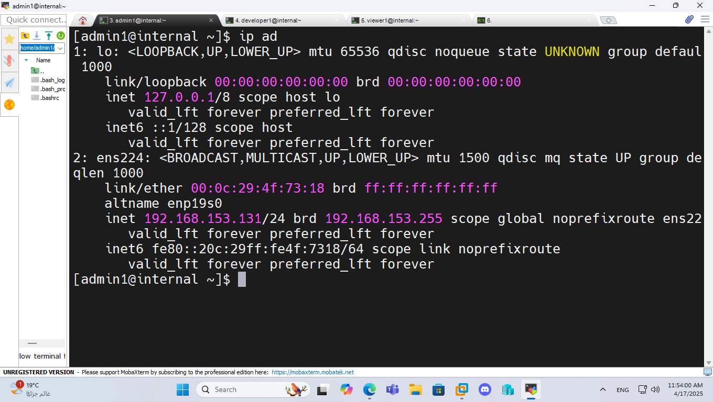

# XYZ Company 

**Supervised by:** Eng. Sondos Alsafy  
**Prepared by:** Eng. Mahmoud Hamed Abdel Moniem

---

## Overview

This project focuses on setting up and configuring a basic internal server for XYZ Company. It includes IP configuration, hostname setup, user management, permission controls, Apache web server installation, and testing website accessibility.

---

## 🖧 IP Address Configuration (`nmcli` & `ip add`)

Configuring the IP address is crucial to allow the server to communicate with other devices in the internal network.  
We used:

- `nmcli` to modify the network interface and assign a static IP.  
- `ip add` to verify the assigned IP address.



---

## 🖥️ Hostname Configuration (`hostnamectl`)

Setting the correct hostname helps easily identify the server on the network.

- The hostname was set using: `hostnamectl set-hostname internal.xyz.local`


---

## 📄 Edit `/etc/hosts` File

The `/etc/hosts` file maps the hostname to the IP address locally.  
This simulates DNS functionality so users can access the site via a name instead of an IP.


---

## 👥 Check Created Users (`cat /etc/passwd`)

Created users for role-based access:

- `admin1`
- `developer1`
- `viewer1`

Each has specific access permissions for better security and control.


---

## 🔐 Check Sudo Privileges (`sudo -l -U admin1`)

To ensure `admin1` can perform administrative tasks, we checked sudo privileges:

- Added `admin1` to the `wheel` group.


---

## 📁 Verify Directory Permissions

- `developer1` has write access to website directory.
- `admin1` has access to shared files.
  
Commands used:

- `chown` – Change file ownership  
- `chmod` – Set file permissions


---

## 🌐 Check Apache Service Status

Apache installation and status verification:

```bash
dnf install httpd
systemctl enable httpd
systemctl status httpd
